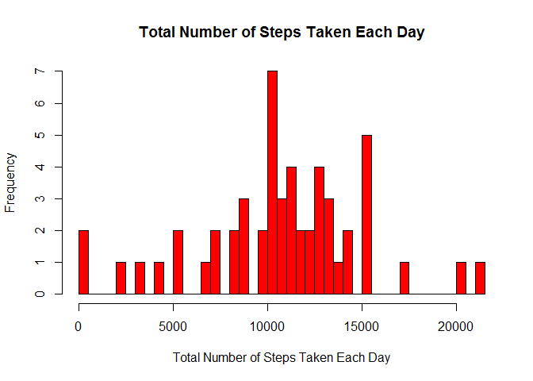
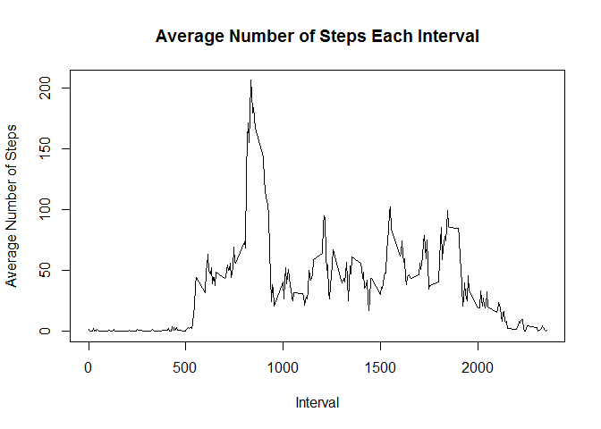
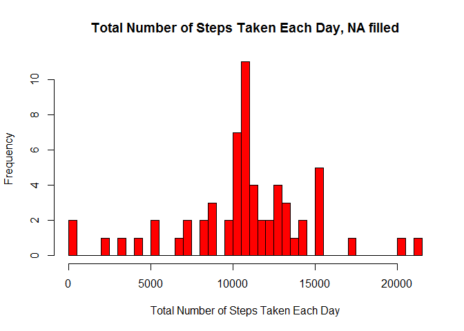
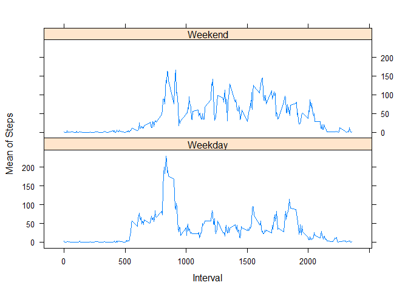

# Reproducible Research: Peer Assessment 1


## Loading and preprocessing the data

Below is the code for importing csv file to R. After loading it, the dates are converted by as.Date function so that the format can be recognized by R.


```r
data <- read.csv("activity.csv")
data$date <- as.Date(data$date, format = "%Y-%m-%d")
```

## What is mean total number of steps taken per day?

First, the steps for each day is calculated.


```r
day_steps <- sapply(split(data$steps, data$date), sum)
```

Second, the histogram is shown.


```r
hist(day_steps, xlab = "Total Number of Steps Taken Each Day", col = "red", main = "Total Number of Steps Taken Each Day", breaks = 61)
```

<!-- -->

Then, the mean and median of are determined.


```r
day_steps_mean <- round(mean(day_steps, na.rm = TRUE), 2)
day_steps_median <- round(median(day_steps, na.rm = TRUE), 2)
```

The mean of the total number of steps is 1.076619\times 10^{4}. The median is 1.0765\times 10^{4}.

## What is the average daily activity pattern?

First, the average number of steps taken in each interval across all days are calculated.


```r
int_steps_mean <- sapply(split(data$steps, data$interval), mean, na.rm = TRUE)
max_steps_interval <- names(int_steps_mean[int_steps_mean == max(int_steps_mean)])
```

The interval of maximum steps is 835.  

Here is the plot the average steps vs. time interval.


```r
plot(unique(data$interval), int_steps_mean, type = "l", xlab = "Interval", ylab = "Average Number of Steps", main = "Average Number of Steps Each Interval")
```

<!-- -->


## Imputing missing values

Below is the code for calculating the sum of missing values.


```r
sum_NA <- sum(is.na(data$steps))
```

The sum of missing values is 2304.  

All missing values are replaced by the average steps for that specific interval.


```r
# make a copy of the data to keep a record.
data_original <- data.frame(data)

# replace the missing value by average steps at that interval.
for (i in 1:nrow(data)){
	if (is.na(data[i, 1]) == TRUE) {
		data[i, 1] <- int_steps_mean[names(int_steps_mean) == as.character(data[i, 3])]
	}
}
```

Then the new histogram is plotted and new parameters are calculated.


```r
# create a new data set that has all missing values filled in.
day_steps_fillNA <- sapply(split(data$steps, data$date), sum)

# plot histogram.
hist(day_steps_fillNA, xlab = "Total Number of Steps Taken Each Day", col = "red", main = "Total Number of Steps Taken Each Day, NA filled", breaks = 61)
```

<!-- -->

```r
#calculate mean and median.
day_steps_mean_fillNA <- mean(day_steps_fillNA)
day_steps_median_fillNA <- median(day_steps_fillNA)
```

The new mean is 1.0766189\times 10^{4}, and the new median is 1.0766189\times 10^{4}.The mean value is the same as before. The new median has the value equal to mean after filling imputing NA values.

## Are there differences in activity patterns between weekdays and weekends?

Function type_of_day is created. This function is used to determine if a day is weekday or weekend.


```r
type_of_day <- function(x){
	if (x %in% c("Monday", "Tuesday", "Wednesday", "Thursday", "Friday")){
		return("Weekday")}
	else {
		return("Weekend")}
}
```

Below is the code for calculating weekday data and weekend data. The plot is generated by xyplot function.


```r
# determine the type of the day for each row.
day_col <- sapply(weekdays(data[, 2]), type_of_day)

# add the day type column to the dataframe.
data <- data.frame(data, day_col)

# generate weekday data and weekend subsets. Thus two dataframes are generated.
weekday_data <- split(data, data$day_col)$Weekday
weekend_data <- split(data, data$day_col)$Weekend

# calculated average steps in each interval for both dataframe.
int_steps_mean_weekday <- sapply(split(weekday_data$steps, weekday_data$interval), mean)
int_steps_mean_weekend <- sapply(split(weekend_data$steps, weekend_data$interval), mean)

# create a new dataframe that used for plotting.
weekday_table <- data.frame(int_steps_mean_weekday, unique(data$interval), "Weekday")
names(weekday_table) <- c("Stepsmean", "Interval", "day")
weekend_table <- data.frame(int_steps_mean_weekend, unique(data$interval), "Weekend")
names(weekend_table) <- c("Stepsmean", "Interval", "day")
new_table <- rbind(weekday_table, weekend_table)

# load lattice package and plot the panel.
library(lattice)
xyplot(Stepsmean ~ Interval | day, data = new_table, layout = c(1, 2), type = "l", ylab = "Mean of Steps")
```

<!-- -->
